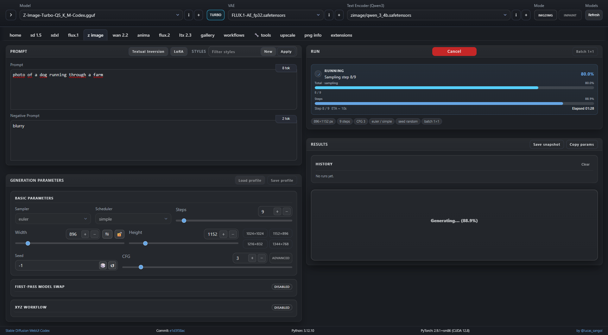
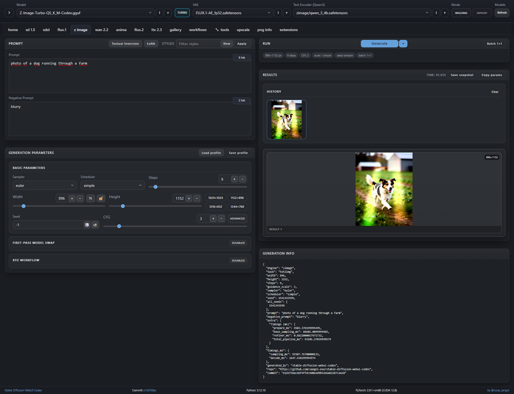

<p align="center">
  
</p>

<h1 align="center">Stable Diffusion WebUI Codex</h1>

<p align="center">
  Local-first FastAPI + Vue 3 WebUI for running modern diffusion pipelines with managed installers and safe updates.
</p>

<p align="center">
  
  
  
  
  
  
  <a href="https://huggingface.co/sangoi-exe/sd-webui-codex"></a>
  <a href="https://github.com/sangoi-exe/pytorch"></a>
</p>

<p align="center">
  Quick links:
  <a href="INSTALL.md">Install</a> |
  <a href="#quick-start">Quick Start</a> |
  <a href="#docker-installation-guide">Docker Install</a> |
  <a href="README_HF_MODELS.md">Model Hub Notes</a> |
  <a href="#custom-pytorch-builds-flashattention2">Custom PyTorch FA2</a> |
  <a href="#support">Support</a>
</p>

<p align="center">
  
</p>

> [!WARNING]
> The `dev` branch contains the newest updates and fixes before they are promoted to the stable branch.
> It may include regressions, incomplete features, or other instabilities.
> Use it if you want the latest changes and are comfortable with occasional breakage.

## Preview screenshots

### Latest



Current Z-Image workspace with prompt, generation, and runtime controls.



Current Z-Image results view with the updated preview and output layout.

### Earlier


Manage API/UI services and runtime startup state from one place.


Run SDXL workflows with generation controls and model/runtime options.

## Custom PyTorch builds (FlashAttention2)

> [!IMPORTANT]
> This project optionally provides Windows PyTorch builds with FlashAttention2 enabled for RTX architecture targets.

- Repository: https://github.com/sangoi-exe/pytorch
- Targeted RTX build variants:
  - `SM80`
  - `SM86`
  - `SM89`
  - `SM90`

For this workflow, these custom builds are the recommended path when you want FA2-enabled runtime behavior.

## What you can run

- Multi-engine workflows: SD15, SDXL, FLUX.1, Z-Image, WAN 2.2, and related adapters.
- Utility views and tools: PNG Info, XYZ plot, GGUF tools, and workflow snapshots.
- Local-first backend/UI stack with managed Python and Node environments.

## Quick start

Prerequisites:
- Git
- Internet access for first install (`uv`, managed Python, repo-local Node.js via nodeenv, and Python wheels)

For detailed install options, backend selection, and troubleshooting, see [INSTALL.md](INSTALL.md).

### Windows

```powershell
.\install-webui.cmd
```

```bat
install-webui.cmd
run-webui.bat
```

Online one-liner + full manual (no installer scripts) are documented in `INSTALL.md`.

Optional safe update:

```bat
update-webui.bat
```

### Linux / WSL

```bash
bash install-webui.sh
./run-webui.sh
```

Optional safe update:

```bash
bash update-webui.sh
# Optional: ignore untracked-path preflight checks (tracked changes still abort)
bash update-webui.sh --force
```

On Linux/WSL, startup prints the local URLs:

```text
[webui] API: http://localhost:7850
[webui]  UI: http://localhost:7860
```

Open the UI URL in your browser. Stop with `Ctrl+C`.

On Windows, use the launcher output/UI to confirm the active API and UI endpoints.

## Docker Installation Guide

Use this path when you want containerized setup with persisted models/output state.

### 1) Build the image

```bash
docker build -t codex-webui:latest .
```

Optional build overrides:

```bash
docker build -t codex-webui:latest . \
  --build-arg CODEX_TORCH_MODE=cpu \
  --build-arg CODEX_TORCH_BACKEND=cu126
```

### 2) Run with GPU and persistent volumes

```bash
docker run --rm -it --gpus all \
  -p 7850:7850 -p 7860:7860 \
  -v "$(pwd)/models:/opt/stable-diffusion-webui-codex/models" \
  -v "$(pwd)/output:/opt/stable-diffusion-webui-codex/output" \
  codex-webui:latest
```

### 3) First-time profile setup only (no API/UI start)

```bash
docker run --rm -it \
  codex-webui:latest --tui --configure-only
```

### 4) Compose path (non-interactive default)

```bash
docker compose up --build
```

First-time interactive profile setup with compose:

```bash
docker compose run --rm webui --tui --configure-only
```

### Docker runtime notes

- Entrypoint is `run-webui-docker.sh` (delegates to `apps/docker_tui_launcher.py` and then `run-webui.sh`).
- Disable interactive TUI with `-e CODEX_DOCKER_TUI=0` or runtime args `--no-tui --non-interactive`.
- If you override `API_PORT_OVERRIDE` or `WEB_PORT` in TUI/profile, host `-p` mappings must use the same ports.
- Docker defaults are preseeded for this project profile (CUDA runtime path, SDPA flash, LoRA online, WAN22 `ram+hd`) and can be overridden with `-e KEY=VALUE` or compose `.env`.
- Default allocator env is `PYTORCH_CUDA_ALLOC_CONF=backend:cudaMallocAsync`.

## Safe updater behavior

`update-webui.(bat|sh)` is fail-closed and non-destructive:

- Dirty worktree checks are strict: tracked changes always abort; untracked changes abort unless `--force` is set.
- `--force` only relaxes untracked-path preflight checks; `git pull --ff-only` safety checks still apply.
- Ignored paths (`.gitignore`) are excluded from dirty-tree abort checks.
- Update path remains non-destructive: `git fetch --prune` + `git pull --ff-only`.

Full contract and edge cases are documented in [INSTALL.md](INSTALL.md).

## Models

Official Hugging Face repo: https://huggingface.co/sangoi-exe/sd-webui-codex

Highlights from the Hub (snapshot from `hf download --dry-run` on 2026-01-29):

- FLUX.1
  - `flux/FLUX.1-dev-Q5_K_M-Codex.gguf`
- Z-Image
  - `zimage/Z-Image-Turbo-Q5_K_M-Codex.gguf`
  - `zimage/Z-Image-Turbo-Q8_0-Codex.gguf`
- WAN 2.2
  - `wan22/wan22_i2v_14b_HN_lx2v_4step-Q4_K_M-Codex.gguf`
  - `wan22/wan22_i2v_14b_LN_lx2v_4step-Q4_K_M-Codex.gguf`
  - `wan22-loras/wan22_i2v_14b_HN_lx2v_4step_lora_rank64_1022.safetensors`
  - `wan22-loras/wan22_i2v_14b_LN_lx2v_4step_lora_rank64_1022.safetensors`
  - `wan22-loras/wan22_t2v_14b_HN_lx2v_4step_lora_rank64_1017.safetensors`
  - `wan22-loras/wan22_t2v_14b_LN_lx2v_4step_lora_rank64_1017.safetensors`

Default model roots are under `models/`:

- `models/sd15/`, `models/sdxl/`, `models/flux/`, `models/zimage/`, `models/wan22/`
- plus `*-vae`, `*-tenc`, `*-loras`

More model hub and folder layout details: [README_HF_MODELS.md](README_HF_MODELS.md).
If you customize model roots, edit [apps/paths.json](apps/paths.json).

## Support

- Bug reports: https://github.com/sangoi-exe/stable-diffusion-webui-codex/issues
- Questions and discussion: https://github.com/sangoi-exe/stable-diffusion-webui-codex/discussions

## License (noncommercial)

- Code license: PolyForm Noncommercial License 1.0.0 ([LICENSE](LICENSE)).
- Required notice must be preserved: [NOTICE](NOTICE).
- Commercial use is not permitted: [COMMERCIAL.md](COMMERCIAL.md).
- Trademarks and branding: [TRADEMARKS.md](TRADEMARKS.md).

## Credits

- Diffusion ecosystem baseline: Hugging Face Diffusers.
- UX and workflow inspiration: AUTOMATIC1111 and Forge.
